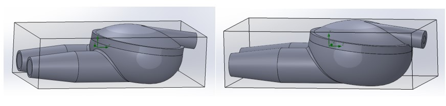

# Modeling blood flow through the artificial heart chamber

## About project
The goal of the project was to study the effect of the velocity of blood entering the heart on the maximum velocity of blood exiting, 
and to see how changing the velocity of blood entering the heart affects the distribution of blood velocity on the exit wall.

The creation of the project involved the construction of two independent parts from which the assembly was made:
- SD project:

- SG project:

- assembly project:

## Technologies
The project was made in **SOLIDWORKS** software.

## Research
Distribution of blood velocity on the outflow wall:

## Results

